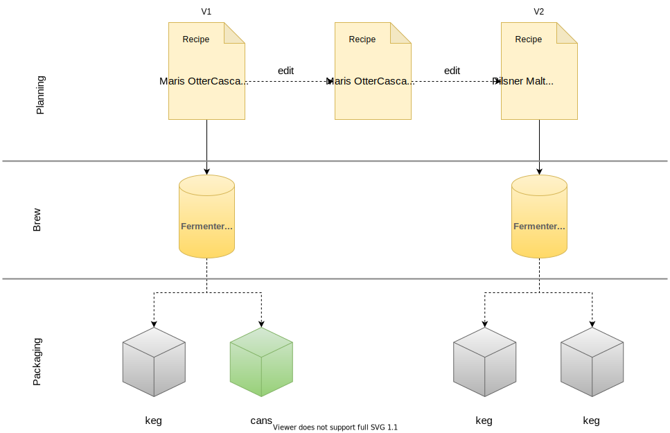

# Run project

## Issues

[Lombok and Java 23](https://github.com/projectlombok/lombok/issues/3752#issuecomment-2366819375)
> As of JDK 23, annotation processing is only run with some explicit configuration of annotation processing or with an explicit request to run annotation processing on the javac command line.
 
Fixed by using `proc=full` with maven for now
```
mvn -Dmaven.compiler.proc=full clean package
```


### Local
The `dev` Spring profile executes the project without the need for external services, e.g., an H2 memory database. `prod` is the default profile.
```
SPRING_PROFILES_ACTIVE=dev
```

  
For running the app locally a set of key/value properties can be defined in `local.yml` to enable certain features.
Secret properties are likely to reside here and will enable the app to connect to external services.
```
# local.yml
authentication:
  enabled: true
supabase:
  url: <SUPABASE_URL>
  anon: <ANON_KEY>
  jwt_secret: <SUPABASE_SECRET>
brewfather:
  api_key: <BREWFATHER_API_KEY>
  user_id: <BREWFATHER_USER_ID>
```

If redis is enabled a local instance of redis needs to be configured. Docker compose provides a redis image

### Docker local
To run separately from dependent services (e.g. database) enable `dev` profile
```
docker build -t nightfly .
docker run -e SPRING_PROFILES_ACTIVE=dev -dp 8080:8080 nightfly
```


## Jobs

Regular applications should be run with the profile `cron`

## Optimizations
Spring AOT with CDS enabled. More than 80% of classes are loaded from CDS archive. Increases build times slightly by adding an extra training step

## Errors

Default error response on invalid json POST request
```
{
    "timestamp": 1702832386349,
    "status": 400,
    "error": "Bad Request",
    "path": "/api/batches"
}
```

Customized error response
```
{
    "status": "BAD_REQUEST",
    "timestamp": "17-12-2023 07:12:46",
    "message": "Invalid JSON request",
    "debugMessage": "JSON parse error: Cannot construct instance of `no.vinny.nightfly.components.batch.domain.BatchStatus`, problem: `java.lang.IllegalArgumentException`",
    "errors": null
}
```


# Application


